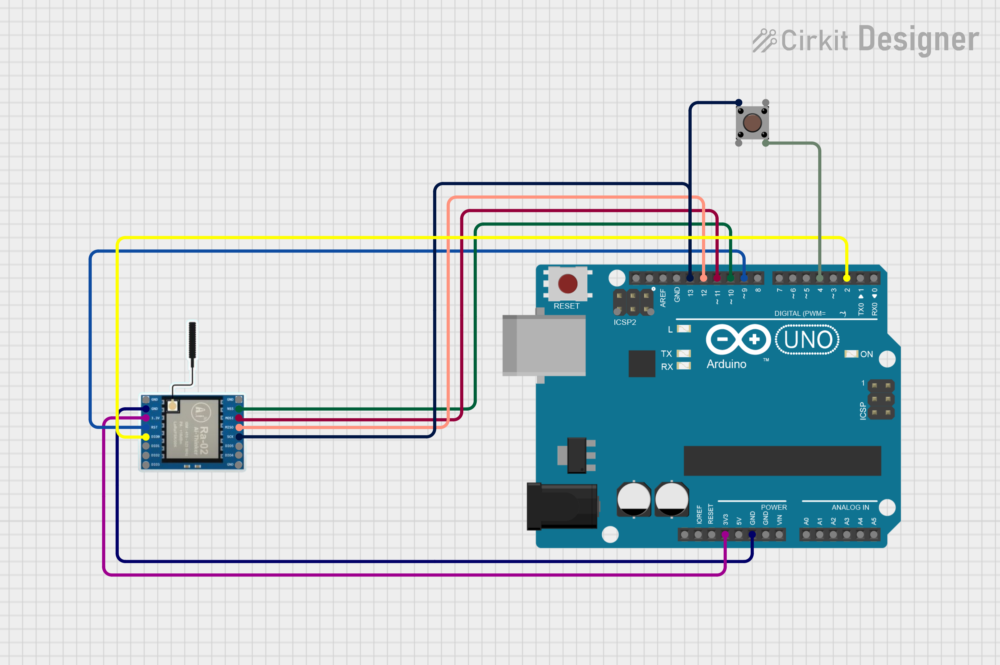
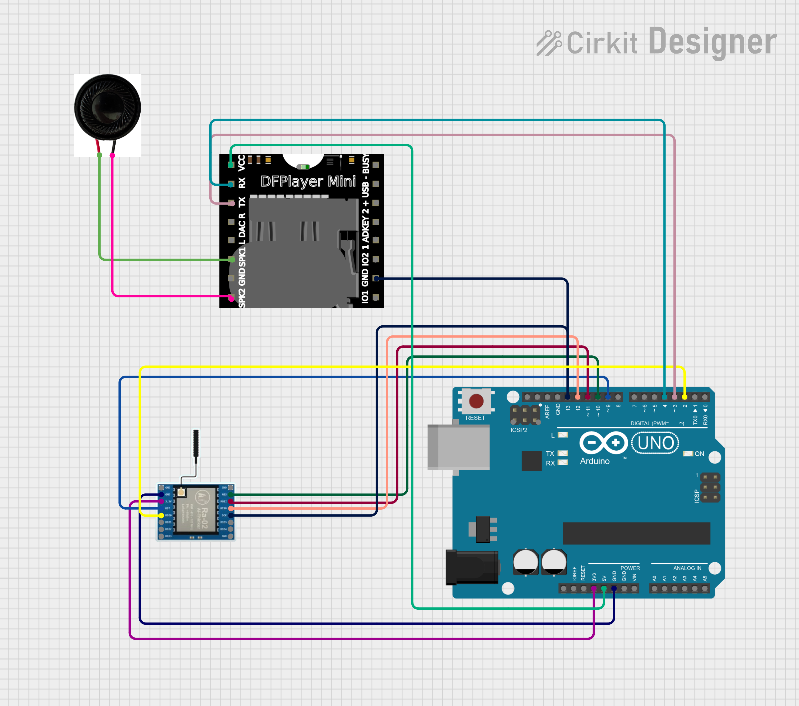

# LoRa Panic Button

A LoRa-based panic button system intended for use in clubs, bars, and other venues where staff might need a quick way to request help from security personnel with radios. This project was originally built for a private setup and is now being open-sourced for anyone who wants to build something similar.

This open-source version operates without encryption or time-based code synchronization (like 2FA systems) as those components remain proprietary. The system incorporates parity bit error correction to ensure reliable message transmission over the LoRa network, helping to prevent false alarms or missed emergency signals due to communication errors.

**Important:** This is a hobby project shared as-is. It is **not** a certified security product. [Check your local regulations](https://letmegooglethat.com/?q=legal+local+frequency+ranges+MHz) before transmitting on the suggested frequency and always test thoroughly before relying on it.

## Features

- **Dual Alert Types**: Single button press sends a standard help request; triple press triggers an emergency alert
- **Reliable LoRa Communication**: Long-range, low-power wireless transmission
  - Up to 10km range in open areas with no obstructions
  - 2-4km range through brick walls and urban environments
- **Error Correction**: Built-in parity bit error correction ensures message integrity and reduces false alarms
- **Multiple Device Support**: Each panic button has a unique ID, allowing multiple units in the same venue
- **Flexible Audio Options**: 
  - Standalone operation with DFPlayer Mini module and speaker
  - Computer/Raspberry Pi integration with customizable sound files per device and alert type
- **Cross-Platform Scripts**: Python receiver scripts for both Windows and Linux/Raspberry Pi
- **Service Integration**: Optional systemd service setup for always-on monitoring on Linux systems
- **Open Hardware Design**: Complete circuit diagrams and parts list included
- **Customizable Frequencies**: Configurable LoRa frequency bands (default 433 MHz)

## Repository Layout

- `src/Sender` – Arduino sketch for the button transmitter. Supports single press for a regular help request and triple press for emergencies.
- `src/Receiver` – Arduino sketch for the receiver with a DFPlayer Mini module for local audio playback.
- `src/ReceiverSerial` – Alternative receiver sketch that outputs events over serial for a computer or Raspberry Pi to process.
- `scripts/` – Helper scripts for Raspberry Pi (Linux) and Windows to play audio when messages are received.
- `docs/` – Circuit diagrams for reference.

## Hardware Overview

- SX1278/SX1276 LoRa modules (433 MHz by default).
- Arduino-compatible boards for both transmitter and receiver.
- Push button for each sender unit.
- *Optional* DFPlayer Mini module and speaker for stand‑alone receivers.
- Alternatively a computer or Raspberry Pi can handle audio using the scripts provided.

The `docs` folder contains wiring examples:

## Arduino Library Dependencies

Before uploading the sketches, you'll need to install the following libraries in Arduino IDE:

**For all sketches (Sender, Receiver, and ReceiverSerial):**
- **LoRa library** by Sandeep Mistry
  - Go to `Sketch` → `Include Library` → `Manage Libraries`
  - Search for "LoRa" and install the library by Sandeep Mistry

**For Receiver sketch only (src/Receiver with DFPlayer Mini):**
- **DFRobotDFPlayerMini library** by DFRobot
  - In Library Manager, search for "DFRobotDFPlayerMini" and install the library by DFRobot
- **SoftwareSerial** (usually included with Arduino IDE by default)

**Installation steps:**
1. Open Arduino IDE
2. Go to `Sketch` → `Include Library` → `Manage Libraries`
3. Search for each library name and click "Install"
4. Restart Arduino IDE after installation

**Library requirements by sketch:**
- `src/Sender` - Requires: LoRa library only
- `src/Receiver` - Requires: LoRa library + DFRobotDFPlayerMini + SoftwareSerial
- `src/ReceiverSerial` - Requires: LoRa library only

**Note:** The ReceiverSerial sketch is designed for use with the Python scripts and doesn't require the DFPlayer Mini hardware or library.

## Quick Start

1. **Install required Arduino libraries** as described in the "Arduino Library Dependencies" section above, then **clone the repository** and open the `src/Sender` and `src/Receiver` sketches in Arduino IDE.
2. **Set the correct LoRa frequency** in each sketch (`LORA_BAND`). The default is 433 MHz; adjust if needed and ensure the frequency is [legal in your region.](https://letmegooglethat.com/?q=legal+local+frequency+ranges+MHz)
3. **Assign unique device IDs** in `Sender.ino` (`DEVICE_ID` constant). Each button should have a different ID (1‑15, hypothetically infinite).
4. **Upload the sketches** to your Arduino boards.
5. If using the Python receiver scripts: **(Note: For automatic setup with a bash script on linux/Pi, see the footnote below.)**
   - In `scripts/Rasberry_pi-Linux` or `scripts/Windows`, run `pip install -r requirements.txt`.
   - Execute `lora_receiver.py` (Linux) or `lora_receiver.py` (Windows). These scripts play different sounds for `HELP` and `EMERGENCY` messages based on device ID.
6. Test by pressing the button on a sender unit. The receiver should decode the message and play the appropriate sound or output to serial.

The Raspberry Pi setup script (`setup.sh`) can optionally configure the Pi to run the listener/receiver as a service (also works for Linux computers).

## Contributing

Pull requests are welcome! If you build improvements or have suggestions, feel free to open an issue or submit a PR.

## License

This project is released under the MIT License. See the [LICENSE](LICENSE) file for details.
